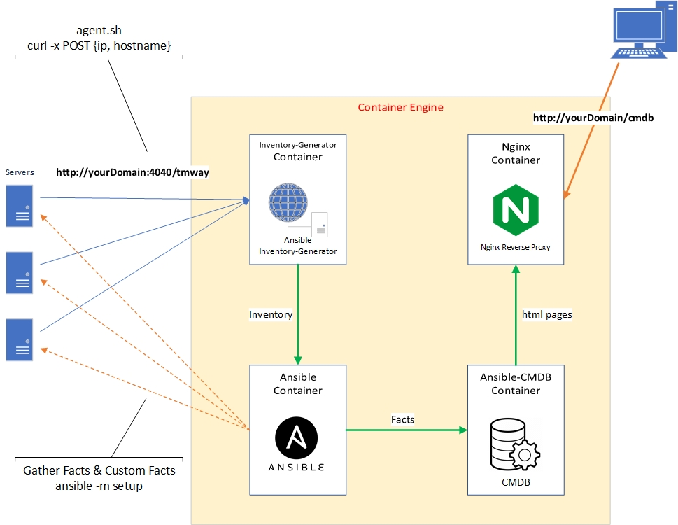

# Ansible CMDB docker-compose

Efficient way for using edited <a href="https://github.com/miladpav/ansible-cmdb" ><b><i>ansible-cmdb</i></b></a> from main source of <a href="https://github.com/fboender/ansible-cmdb" >Ferry Boender</a> 2017.

## Architecture


### Usage:
If you already have ansible provision you just need to use your private key and inventory to connect to servers for gathering facts.

You can use [commands.sh](commands.sh) structure, its simple.

download latest release of this repo and follow steps on [commands.sh](commands.sh):
```download-steps
wget https://github.com/miladpav/cmdb-stack/archive/refs/heads/master.zip
unzip master.zip
cd cmdb-stack-master
```

docker steps:
```docker-steps
docker network create --driver bridge --opt encrypted ansible-net
docker-compose build
docker-compose up -d
```

If you already have `ansible` infrastructure you can use your own private key and inventory. otherwise you should follow below steps.
```ssh-key-steps
ssh-keygen -t rsa -b 4096 -f ./ssh-keys/root-id_rsa -N ''
#ssh-copy-id -i ./ssh-keys/root-id_rsa root@Servers
## add servers ip to agent-hosts inventory file with [agent] group
#echo "servers_ip" >> ./inventory/agent-hosts
```

use ip address or domain name of docker host. example here: `docker-server=192.168.40.135`
for next step we should install tmway agent

tmway is a auto inventory generator for ansible you can read about it on:
[https://github.com/miladpav/Tell-Me-Who-Are-You](https://github.com/miladpav/Tell-Me-Who-Are-You)


You just need to run [agent_install.yml playbook](playbooks/tmway-agent/agent_install.yml) on your servers via ansible:
```install-agent-steps
docker exec ansible ansible-playbook -i /inventory/agent-hosts \
-e ansible_ssh_private_key_file=/ssh-keys/root-id_rsa -e yourDomain=192.168.40.135 \
/playbooks/tmway-agent/agent_install.yml
```
if latest playbook runs successfully, new inventory has been generated automatically in `inventory/hosts.ini` then we can gather data from this inventory

you can add this command to cron to keep update data every day. example crontab-time: `0 02 * * *`
```gather-facts-steps
docker exec ansible ansible-playbook -i /inventory/hosts.ini \
-e ansible_ssh_private_key_file=/ssh-keys/root-id_rsa \
/playbooks/gather-facts/gather-facts.yml
```

you can add this command to cron to keep update htmls every day. example crontab-time:`0 03 * * *`
```create-cmdb-html-steps
docker exec cmdb \
ansible-cmdb -d -C /template/custom-columns.conf \
-i /inventory/hosts.ini -t html_fancy_split -p local_js=0 \
--columns name,groups,main_ip,fqdn,all_ipv4,os,kernel,arch,virt,vcpus,cpu_type,ram,mem_usage,disk_usage,timestamp,prodname \
/facts/
```

### What does this project do?
Gathering infrastructure information are challenging specially on large scale assets. CMDB definition can help us to keep our information in centralized database or file updated. Thanks to Ferry Boender for amazing [ansible-cmdb](https://github.com/fboender/ansible-cmdb) repo we can use ansible for gather this information more effectively and combine with some actions to do it fully automatically. Ofcourse we have better solutions on cloud native infrastructure, but incase we cant access clouds or any similar infrastructure we can use this repo.